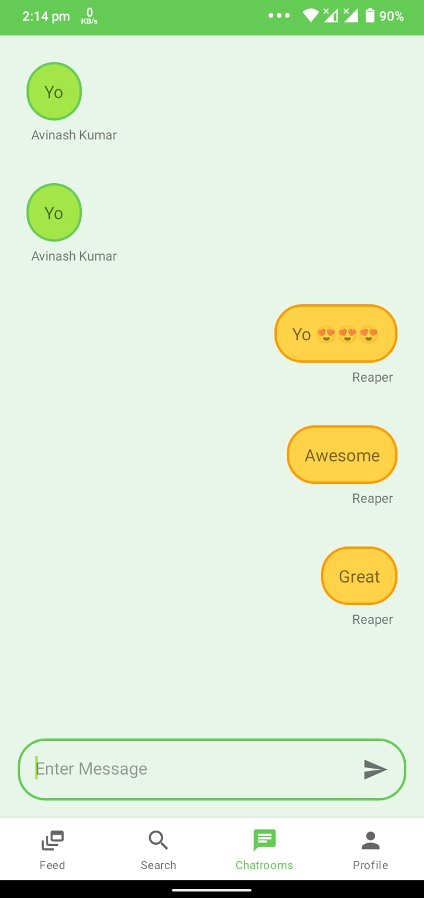
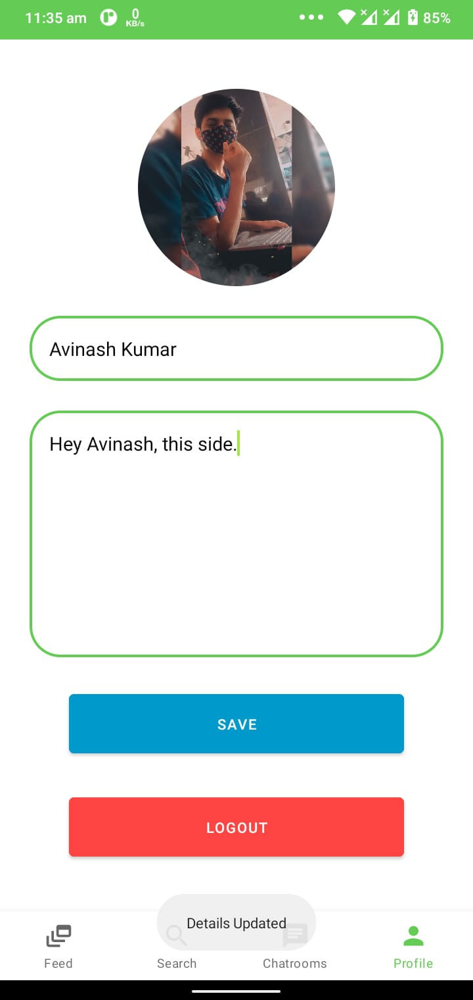

# ChatX - v1.0:

- It is a simple, reliable, fun and creative social network service.
- It is a valuable communication tool with others locally and worldwide, as well as to share, create, and spread information.
- ChatX allows you to share your photos and videos with your friends, families and followers.
- It also provides a chatroom for secure messaging. Multiple chatrooms can be created by a user.
- Users can like and comment on photos and follow other users to add their content to a personal feed.

# Preview:

  
   
  
  
  
  
  
  

# Functionalities:

# Tools/Technologies Used:

- Kotlin
- FirebaseAuth (Authentication)
- Firebase Firestore Database (Non-Relational Database)
- Firebase Storage
- Firebase UI: FirebaseRecyclerView

# Project Structure:

# Live Working Preview:

# Credits:
